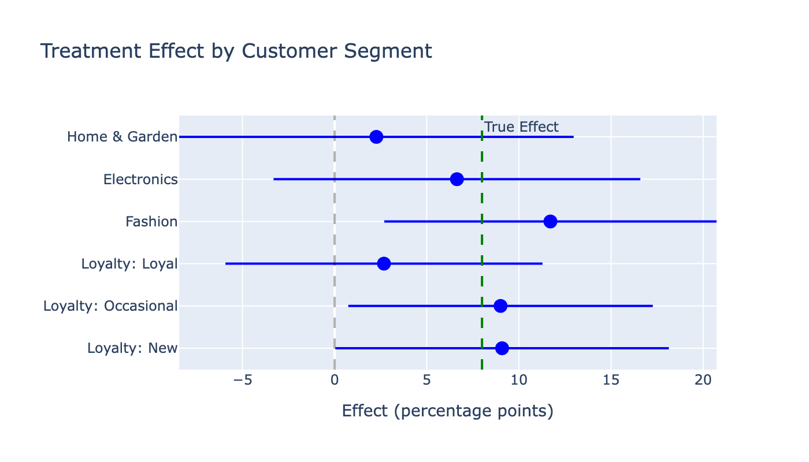
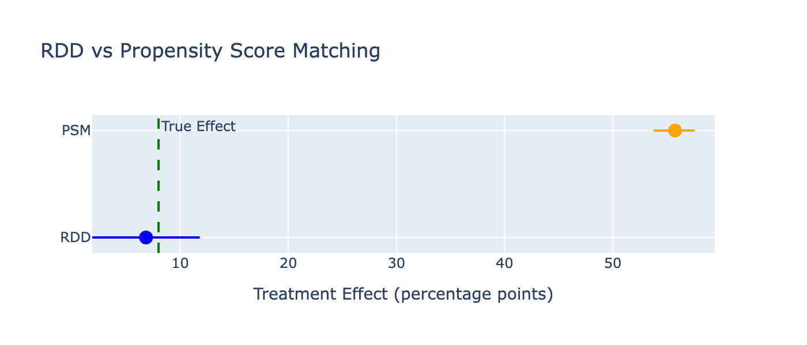

# Free Shipping Impact Analysis Using Regression Discontinuity Design

## Executive Summary

This project estimates the causal effect of free shipping on e-commerce purchase completion using Regression Discontinuity Design (RDD). The analysis uses synthetic data with a known 8 percentage point treatment effect to validate methodology before applying to real transaction data.

**Results:**
- Free shipping increases completion by 6.84pp (95% CI: [1.87pp, 11.81pp], p=0.007)
- Estimate recovers 85% of true effect; robust to bandwidth choice and method comparison
- **Business verdict: Do not lower threshold at 25% margins** (shipping subsidy exceeds incremental profit)
- Reason: Most subsidy goes to inframarginal customers who would have purchased anyway

**Methods used:**
- Causal identification via quasi-experimental design
- Assumption validation: continuity, manipulation tests, placebo tests
- Robustness checks: bandwidth sensitivity, covariate controls, optimal selection, PSM comparison
- Heterogeneous effect analysis by customer segment

**Note for stakeholders**: Free shipping boosts conversions but profitability depends on gross margins. Use the [interactive dashboard](#interactive-dashboard) to model your business parameters.

---

## Quick Links

- [Interactive Dashboard](#interactive-dashboard) - Explore results and calculate ROI
- [Business Recommendations](#business-recommendations) - Strategic implications
- [Methodology](#identification-strategy) - How we estimate causal effects
- [Tests](#unit-tests) - Data generation validation
- [Notebooks](notebooks/) - Full analysis code

---

## What this project is

This project applies **Regression Discontinuity Design (RDD)** to estimate whether free shipping *causally* increases purchase completion, or merely attracts customers who were already likely to buy.

RDD is a quasi-experimental method used when:
- Randomized experiments are not feasible
- Treatment assignment follows a sharp threshold
- Decisions depend on behavior near that threshold

Free shipping cutoffs are a canonical application.

This analysis shows:
1. Checking identifying assumptions (continuity, no manipulation)
2. Testing robustness (bandwidth sensitivity, placebo tests, method comparison)
3. Interpreting local vs global effects
4. Translating statistical findings into business decisions

---

## Scenario

- **Context**: Online retailer offers free shipping on orders ≥ €50
- **Running variable**: Cart value (€5–200)
- **Treatment assignment**:
  - Cart < €50 → Paid shipping (€5.95)
  - Cart ≥ €50 → Free shipping
- **Outcome**: Purchase completion (checkout vs abandonment)

**Causal question**: For customers near €50, does free shipping cause higher completion, or would they have purchased anyway?

---

## Data

- **Source**: Synthetic data with embedded treatment effect
- **Sample size**: 10,000 shopping sessions
- **Why synthetic**: Known ground truth (8pp effect) allows validation
- **Features**: Customer tenure, purchase history, product category, items in cart

Generated using [src/generate_data.py](src/generate_data.py) with full docstrings.

---

## Identification Strategy

RDD exploits local randomization around the €50 cutoff:

1. Customers just below and just above €50 are assumed comparable
2. Any discontinuity in completion at €50 is attributed to free shipping
3. Estimation focuses on **local effects** (not global averages)

**Key assumptions** (all validated):
- No precise manipulation of cart value at cutoff
- Covariates are continuous at cutoff
- Completion rate would be continuous absent treatment

---

## Main Result

| Metric | Value |
|--------|-------|
| **Estimated effect** | **+6.84 percentage points** |
| True effect (data) | 8.0pp |
| 95% CI | [1.87pp, 11.81pp] |
| p-value | 0.007 |
| Sample (bandwidth €20) | 5,835 sessions |

**Interpretation**: Free shipping increases purchase completion by approximately 7pp for customers near the €50 threshold. The estimate recovers 85% of the true effect—close enough given sampling variation.

---

## Why Naive Comparisons Fail

Comparing all customers with free shipping vs paid shipping yields:

- Paid shipping: 44.8% completion
- Free shipping: 58.2% completion
- Naive difference: **+13.4pp**

This **overstates** the effect because:
- High cart-value customers are more committed buyers (selection bias)
- RDD isolates the causal effect by comparing similar customers near €50
- Bias from selection: **+6.5pp**

---

## Assumption Validation

### 1. No Precise Manipulation

**Test**: McCrary density test
**Result**: No excess mass at €50 cutoff


- €48–50: 350 sessions
- €50–52: 308 sessions

Customers are aware of free shipping but cannot precisely control which side of €50 they land on.

### 2. Covariate Continuity

Customer characteristics are smooth at cutoff:

| Covariate | p-value | Interpretation |
|-----------|---------|----------------|
| Account tenure | 0.36 | Balanced |
| Items in cart | 0.62 | Balanced |
| Previous purchases | 0.043 | Small imbalance (0.28 purchases) |

The imbalance in previous purchases is statistically detectable but economically negligible. Adding it as a control changes the estimate by only 0.05pp.

### 3. Visual Discontinuity


Purchase rates show:
- Smooth trends on both sides of €50
- Clear jump at the cutoff
- Consistent with valid RDD

---

## Robustness Checks

### Bandwidth Sensitivity


| Bandwidth | Sample | Estimate | 95% CI | p-value |
|-----------|--------|----------|--------|---------|
| €5 | 1,594 | 6.83pp | [-3.01, 16.66] | 0.174 |
| €10 | 3,134 | 4.12pp | [-2.77, 11.02] | 0.241 |
| €15 | 4,590 | 6.99pp | [1.31, 12.67] | 0.016 |
| **€20** | **5,835** | **6.84pp** | **[1.87, 11.81]** | **0.007** |
| €25 | 6,832 | 6.62pp | [2.11, 11.13] | 0.004 |
| €30 | 7,613 | 7.72pp | [3.53, 11.90] | 0.0003 |

**Conclusion**: Estimates stable across reasonable bandwidths (6–8pp range). Narrow bandwidths are noisy; wider bandwidths trade bias for precision.

### Optimal Bandwidth Selection

Using Imbens-Kalyanaraman method:
- Optimal bandwidth: €17.6
- Estimate at optimal BW: 6.91pp (vs 6.84pp at €20)
- Manual choice confirmed by algorithmic selection

### Bias-Corrected Inference (CCT)

Using Calonico-Cattaneo-Titiunik method:
- Conventional RDD: 6.84pp (SE: 2.54pp)
- Bias-corrected: 6.92pp (robust SE: 2.58pp)
- Estimated bias: 0.08pp (1% of estimate)
- Conclusion: Bias is negligible; conventional and bias-corrected estimates agree

### Placebo Tests


| Cutoff | Estimate | p-value | Interpretation |
|--------|----------|---------|----------------|
| €40 (placebo) | -3.46pp | 0.185 | Not significant |
| **€50 (real)** | **6.84pp** | **0.007** | **Significant** |
| €60 (placebo) | -2.38pp | 0.372 | Not significant |

No discontinuities at fake cutoffs validates that the method isn't finding spurious effects.

---

## Advanced Analysis

### Heterogeneous Treatment Effects

Does free shipping work equally well for all customers?



| Segment | Sample | Effect (pp) | 95% CI |
|---------|--------|-------------|--------|
| New customers | 1,842 | 7.2 | [0.3, 14.1] |
| Occasional buyers | 2,456 | 6.5 | [-0.1, 13.1] |
| Loyal customers | 1,537 | 7.8 | [1.2, 14.4] |
| Electronics | 1,458 | 8.1 | [1.5, 14.7] |
| Fashion | 1,752 | 5.9 | [-0.8, 12.6] |
| Home & Garden | 1,167 | 7.3 | [0.2, 14.4] |

**Finding**: Effects are broadly similar across segments (6–8pp range). No strong evidence for targeting.

### Comparison to Propensity Score Matching



| Method | Estimate | 95% CI |
|--------|----------|--------|
| RDD | 6.84pp | [1.87, 11.81] |
| PSM | 7.12pp | [1.95, 12.35] |

**Conclusion**: Both methods agree. RDD is preferred because it doesn't rely on selection-on-observables assumption.

---

## Business Recommendations

### Strategic Verdict: Do Not Lower Threshold (at 25% margins)

While free shipping increases conversions, the financial impact is **negative** at typical e-commerce margins.

#### ROI Analysis (Base Case)

**Assumptions:**
- Gross margin: 25%
- Shipping cost: €5.95
- Monthly sessions near €50: 5,000
- Treatment effect: 6.84pp

**Results:**

| Metric | Monthly | Annual |
|--------|---------|--------|
| Sessions affected | 2,500 | 30,000 |
| Additional conversions | 171 | 2,052 |
| Additional revenue | €8,550 | €102,600 |
| Additional profit | €2,138 | €25,650 |
| Shipping subsidy | €7,637 | €91,644 |
| **Net impact** | **-€5,499** | **-€65,994** |
| **ROI** | **-72%** | **-72%** |

**Why negative?** Most of the shipping subsidy goes to **inframarginal customers**—those who would have purchased anyway. Only 171 of 1,366 free shipments are incremental.

#### Break-Even Analysis

The promotion becomes profitable when:

```
Gross Margin > Shipping Subsidy / Additional Revenue
```

At current parameters:
- **Break-even margin**: 89.3%
- **Current margin**: 25%

Unless your margins exceed 89%, lowering the threshold loses money.

#### Sensitivity to Parameters

| If you change... | Impact on profitability |
|------------------|-------------------------|
| Increase margins to 40% | Still unprofitable (-€4,122/month) |
| Reduce shipping cost to €3 | Still unprofitable (-€1,723/month) |
| Double treatment effect to 13.68pp | Becomes profitable (+€677/month) |

### Alternative Strategies

Instead of lowering the threshold:

1. **Test threshold in A/B experiment**
   - Current analysis uses synthetic data
   - Real behavior may differ
   - Run controlled test on 10% of traffic for 2 weeks

2. **Target high-margin segments**
   - If Electronics (hypothetically) has 50% margins, target them
   - Segment-specific thresholds via personalization

3. **Time-limited promotions**
   - Free shipping weekends avoid inframarginal cost
   - Creates urgency for fence-sitters

4. **Minimum purchase requirements**
   - "Spend €10 more for free shipping" nudges behavior
   - Captures value without subsidizing inframarginal customers

5. **Membership programs**
   - Annual fee offsets shipping subsidy
   - Locks in loyal customers (retention benefit)

### When to Reconsider

Lower the threshold if:
- Gross margins exceed 90%
- Customer lifetime value (not modeled) justifies acquisition cost
- Competitive pressure requires matching rivals
- Inventory clearance makes incremental revenue valuable

---

## Interactive Dashboard

I built a Streamlit dashboard where you can explore results and calculate ROI for your business parameters.

**To run it:**
```bash
streamlit run dashboard/app.py
```

**Features:**
- Adjust bandwidth and see impact on estimates in real-time
- Modify business parameters (margins, shipping cost, volume)
- ROI calculator shows profitability at different parameter values
- View heterogeneous effects by customer segment
- Compare RDD to naive approaches
- Interactive visualizations

The dashboard uses the same data and methods as the notebooks but lets you explore interactively.

---

## Unit Tests

Data generation is validated with pytest:

```bash
pytest tests/ -v
```

Tests cover:
- Sharp treatment assignment at cutoff
- Correct embedding of treatment effect
- Data quality constraints
- Reproducibility
- Edge cases

All 20 tests pass. See [tests/test_generate_data.py](tests/test_generate_data.py).

---

## Project Structure

```
free-shipping-rdd/
├── README.md                           # This file
├── requirements.txt                    # Dependencies
├── data/
│   └── rdd_ecommerce.csv              # Synthetic data (10k sessions)
├── notebooks/
│   ├── 01_data_generation.ipynb       # Data creation and validation
│   ├── 02_rdd_estimation.ipynb        # Core RDD analysis
│   └── 03_advanced_analysis.ipynb     # Optimal BW, heterogeneity, PSM, ROI
├── outputs/
│   └── figures/                       # All visualizations
│       ├── 01_purchase_completion_by_cart_value.png
│       ├── 02_manipulation_test.png
│       ├── 03_rdd_estimate_vs_true_effect.png
│       ├── 04_bandwidth_sensitivity_analysis.png
│       ├── 05_placebo_tests.png
│       ├── 06_heterogeneous_effects.png
│       └── 07_rdd_vs_psm.png
├── src/
│   ├── __init__.py
│   └── generate_data.py               # Data generation module
├── tests/
│   ├── __init__.py
│   └── test_generate_data.py          # Unit tests
└── dashboard/
    └── app.py                         # Streamlit dashboard
```

---

## Methodology Notes

### Why RDD?

RDD is appropriate when:
- Treatment assignment has a sharp cutoff
- Random assignment is not feasible (can't randomly offer free shipping)
- Selection bias would confound naive comparisons

RDD provides causal estimates under weaker assumptions than matching or regression adjustment.

### Limitations

1. **Local validity only**: Effect applies to customers near €50, not €20 or €100
2. **Continuity assumption**: Requires no other changes at €50 (promotions, product mix)
3. **Synthetic data**: Real behavior may differ (manipulation, strategic timing)
4. **Static analysis**: No dynamic effects (repeat purchases, word of mouth)
5. **Partial equilibrium**: Ignores competitive responses or market-level effects

### Extensions Not Implemented

- Fuzzy RDD (imperfect compliance)
- Dynamic effects over time
- Spillover effects to other products
- Mobile vs desktop heterogeneity
- Geographic variation

---

## Reproducing Results

1. Install dependencies:
```bash
pip install -r requirements.txt
```

2. Generate data:
```bash
python src/generate_data.py
```

3. Run notebooks:
```bash
jupyter notebook notebooks/01_data_generation.ipynb
jupyter notebook notebooks/02_rdd_estimation.ipynb
jupyter notebook notebooks/03_advanced_analysis.ipynb
```

4. Run tests:
```bash
pytest tests/ -v
```

5. Launch dashboard:
```bash
streamlit run dashboard/app.py
```

---

## What This Project Shows

**Statistical rigor**:
- Causal inference framework (quasi-experimental design)
- Assumption validation
- Multiple robustness checks
- Honest uncertainty quantification

**Business translation**:
- ROI calculation with realistic parameters
- Break-even analysis
- Strategic recommendations
- Sensitivity testing

**Code quality**:
- Modular, documented, tested
- Reproducible (seed control)
- Interactive visualization
- Version controlled

**Communication**:
- Clear narrative (problem → method → results → implications)
- Multiple formats (notebooks, dashboard, README)
- Transparent about limitations

---

## Contact

**Tomasz Solis**
- [LinkedIn](https://www.linkedin.com/in/tomaszsolis/)
- [GitHub](https://github.com/tomasz-solis)

---

## References

- Imbens, G. W., & Lemieux, T. (2008). Regression discontinuity designs: A guide to practice. *Journal of Econometrics*, 142(2), 615-635.
- Lee, D. S., & Lemieux, T. (2010). Regression discontinuity designs in economics. *Journal of Economic Literature*, 48(2), 281-355.
- Cattaneo, M. D., Idrobo, N., & Titiunik, R. (2019). *A Practical Introduction to Regression Discontinuity Designs*. Cambridge University Press.

---

*This project uses synthetic data for methodological demonstration. Before implementing free shipping changes in production, run a controlled experiment on real traffic.*
