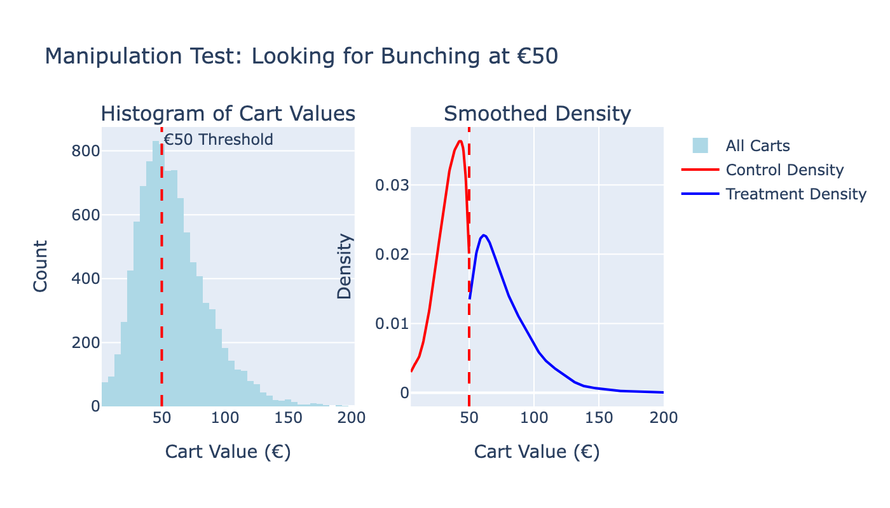
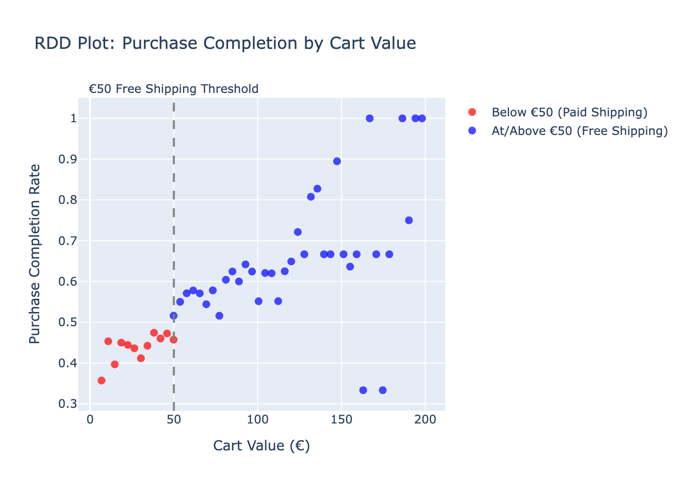
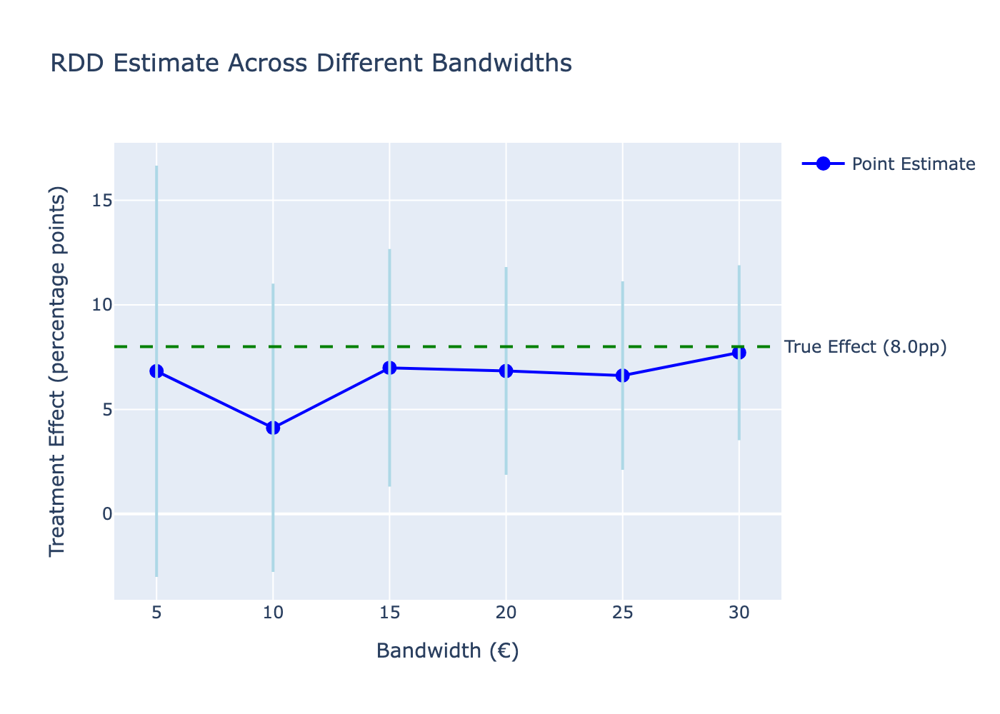
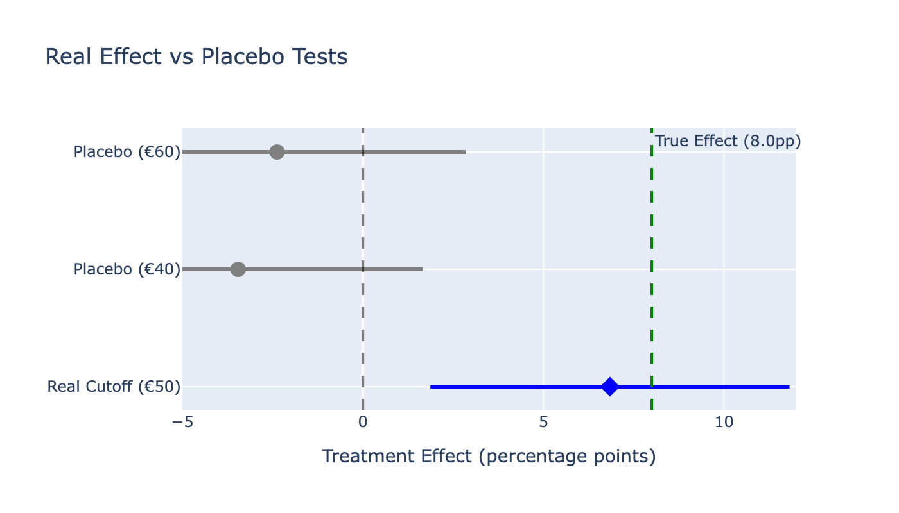

# Learning RDD: Free Shipping Impact Analysis

## What this project is

This project applies **Regression Discontinuity Design (RDD)** to a realistic e-commerce problem: does free shipping *causally* increase purchase completion, or does it mostly attract customers who were already likely to buy?

The purpose is to demonstrate how RDD works in practice—how the identifying assumptions are checked, how estimates behave under sensitivity analysis, and how results should be interpreted and limited.

The analysis uses synthetic data with a known treatment effect to make validation explicit.

---

## Why this approach

### Synthetic data (by design)

The data are generated with a known treatment effect of **8 percentage points**. This allows direct evaluation of whether the RDD implementation recovers the underlying effect before applying the method to real transaction data where the truth is unobservable.

The goal is methodological clarity, not realism for its own sake.

### Why RDD

RDD is appropriate when:
- randomized experiments are not feasible,
- treatment assignment follows a sharp threshold,
- and decisions depend on behavior near that threshold.

Free shipping cutoffs are a canonical example.

---

## Scenario

- **Context:** Online retailer offers free shipping on orders ≥ €50  
- **Running variable:** Cart value (€5–200)  
- **Treatment assignment:**
  - Cart < €50 → Paid shipping (€5.95)
  - Cart ≥ €50 → Free shipping
- **Outcome:** Purchase completion (checkout vs abandonment)

**Causal question:**  
For customers near €50, does free shipping cause higher completion rates, or would they have purchased anyway?

---

## Data generation and setup

- 10,000 synthetic shopping sessions
- Customer heterogeneity (tenure, purchase history)
- Product category variation
- Known treatment effect embedded (8pp)

The full data generation logic is documented in `src/generate_data.py`.

---

## Identification strategy

RDD exploits local randomization around the €50 cutoff.

- Customers just below and just above €50 are assumed to be comparable
- Any discontinuity in purchase completion at €50 is attributed to free shipping
- Estimation focuses on **local effects**, not global averages

---

## Main result

**Estimated treatment effect:** **+6.84 percentage points**

- True effect (data generating process): 8.0pp  
- 95% CI: [1.87pp, 11.81pp]  
- p-value: 0.007  

The estimate is directionally correct and reasonably close to the true effect, given noise and finite samples.

---

## Why naive comparisons fail

Comparing all customers with free shipping vs paid shipping yields:

- Paid shipping: 44.8% completion  
- Free shipping: 58.2% completion  
- Naive difference: **+13.4pp**

This conflates the treatment effect with customer selection: high cart-value customers are more committed buyers.

RDD restricts comparison to customers near €50, where this confounding is minimized.

---

## Assumption validation

### 1. No precise manipulation

**Test:** McCrary density test  


- €48–50 carts: 350 sessions  
- €50–52 carts: 308 sessions  
- No excess mass at the cutoff

Although customers are aware of free shipping, they do not appear able to precisely control which side of €50 they land on.

---

### 2. Covariate continuity

Customer characteristics are smooth at the cutoff:

- Account tenure: balanced (p = 0.36)
- Items in cart: balanced (p = 0.62)
- Previous purchases: small imbalance (p = 0.043, difference = 0.28 purchases)

The imbalance is statistically detectable but economically negligible.

---

### 3. Visual discontinuity



Purchase completion rates show:
- smooth trends on both sides of €50
- a clear jump at the cutoff

This pattern is consistent with a valid RDD.

---

## Bandwidth sensitivity



**Results:**

| Bandwidth | Sample | Estimate | 95% CI | p-value |
|-----------|--------|----------|--------|---------|
| €5  | 1,594 | 6.83pp | [-3.01, 16.66] | 0.174 |
| €10 | 3,134 | 4.12pp | [-2.77, 11.02] | 0.241 |
| €15 | 4,590 | 7.00pp | [1.31, 12.67] | 0.016 |
| €20 | 5,835 | 6.84pp | [1.87, 11.81] | 0.007 |
| €25 | 6,832 | 6.62pp | [2.11, 11.13] | 0.004 |
| €30 | 7,613 | 7.72pp | [3.53, 11.90] | 0.0003 |

**Interpretation:**
- Estimates are stable in the 6–8pp range
- Narrow bandwidths are noisy
- Wider bandwidths improve precision at the cost of potential bias

A bandwidth of €20 is used as a reasonable middle ground.

---

## Covariate controls

Adding the slightly imbalanced covariate (previous purchases):

- Without control: 6.84pp  
- With control: 6.89pp  

Difference: 0.05pp

This confirms that identification comes from the discontinuity, not from covariate adjustment.

---

## Placebo tests



- Fake cutoff at €40 (paid shipping on both sides): no effect
- Fake cutoff at €60 (free shipping on both sides): no effect
- True cutoff at €50: significant jump

This supports the interpretation that the discontinuity is treatment-related rather than spurious.

---

## What this project demonstrates

- Correct use of RDD for local causal effects
- Explicit validation of identifying assumptions
- Sensitivity analysis as a first-class requirement
- Clear separation between statistical and economic significance

---

## Limitations

- Effect applies only to customers near €50
- Results should not be extrapolated to other cart values
- Synthetic data simplifies real behavioral dynamics
- No strategic pricing or promotional interactions modeled

---

## Project structure

```
rdd-free-shipping/
├── README.md                           # This file
├── data/
│   └── rdd_ecommerce.csv              # Synthetic data (10k sessions)
├── notebooks/
│   ├── 01_data_generation.ipynb       # Data generation and validation
│   └── 02_rdd_estimation.ipynb        # Analysis, sensitivity, robustness
├── outputs/
│   └── figures/                       # All visualizations
│       ├── 01_purchase_completion_by_cart_value.png
│       ├── 02_manipulation_test.png
│       ├── 03_rdd_estimate_vs_true_effect.png
│       ├── 04_bandwidth_sensitivity_analysis.png
│       └── 05_placebo_tests.png
└── src/
    ├── generate_data.py               # Data generation with full docstrings
    └── __init__.py
```


---

## Closing note

This project focuses on disciplined causal reasoning rather than polished results. The emphasis is on *how* the effect is identified, validated, and constrained—not on producing the largest or most convenient estimate.

---

## Contact

**Tomasz Solis**  
- [LinkedIn](https://www.linkedin.com/in/tomaszsolis/)  
- [GitHub](https://github.com/tomasz-solis)